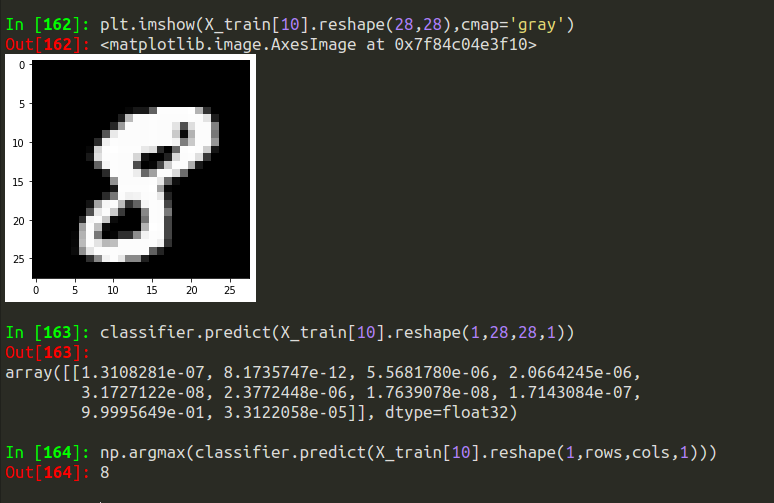

# Digit-classification-CNN

On MNIST digit dataset, CNN is applied to predict the digit label of an image of unknown label

# Example
 

Here we have an image ( we dont know its label yet ) , after passing this image into CNN model,
we can see the probability of this images being a digit 0-9
and then also the digit which has maximum probability , here it is showing digit 8 has maximum probability of being the label of this image

 
